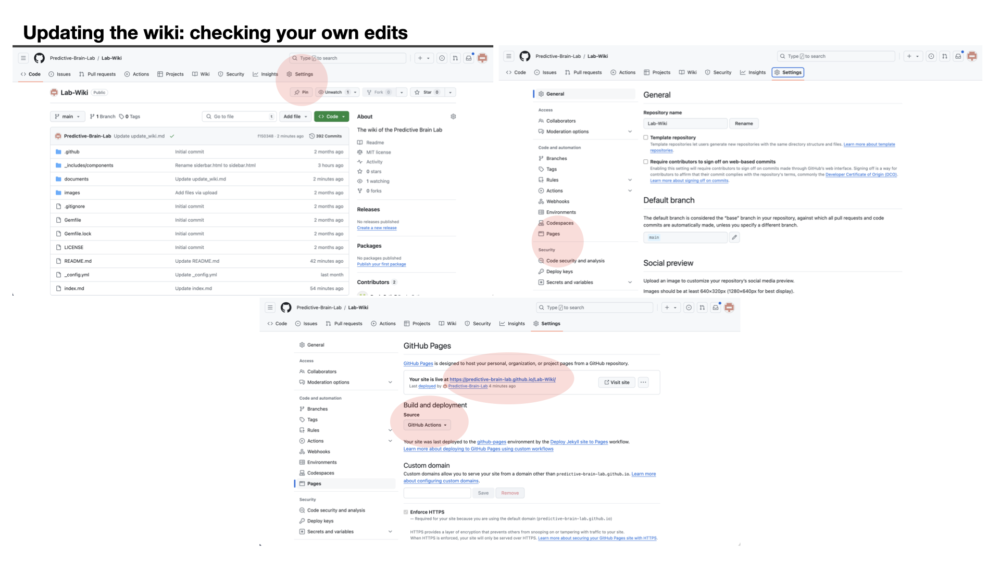

# Updating the Wiki

This page provides a _step-by-step_ on how to contribute to this wiki repository. 
As this is a resource with the lab members in mind, we highly encourage your contribution to it. We selected GitHub as the hosting website given the ease to make edits on your own and the software's capacity to have multiple users editing simultaneously.

If you have any resources/tools/knowledge you think others might find useful. Please add them to the current website. 

### Contributing to This Wiki

If you have never used GitHub before, please go to the [Technical Help]() page of the wiki and check our resources on how to use GitHub. **You do not need to be an expert on GitHub to be able to edit this website**. It should take max. _30 minutes_ of your time to understand how to use the basic functions (_e.g.,_ creating an account, forking a repository, pull request, etc) and be able to edit this page. 

#### Step-by-Step 

1. Go to the repository where the wiki is hosted ([here](https://github.com/Predictive-Brain-Lab/Lab-Wiki))
2. Fork the repository (_ie.,_ personal new repository that share the code with original repository) -- [_forks are used to propose changes to someone else's code._](https://docs.github.com/en/pull-requests/collaborating-with-pull-requests/working-with-forks/fork-a-repo)
3. Clone the fork to your own personal GitHub account. _Note_: You must have a personal GitHub account to edit this wiki.
4. Once you have succesfully forked the repository, browse through the _Files_ tab on the left side of the website screen displaying the different files linked to that repository. The structure should be self-explanatory as clear labels and folders have been used. These files are the different components of the wiki. Those ending with `.md` are Markdown files and contain the content displayed in the wiki. These are the ones that you will be editing (if you do not know how to use Markdown, see our [how_to_markdown]() file containing different function examples or find more information online) 
5. Find the `.md` file you want to edit or create a new one using the following header:
```
--- 
layout: default
title: where to get tasty lunch around the DCCN?
nav_order: 1
parent: ???
grand_parent: ???
---
```

{: .note}
> Only add the nav_order section if you want the page to be displayed as one of the options on the wiki's index. Add a parent if you want it to be part of an already existing tab, add the grandparent if you want it to be part of a tab inside a tab


6. Add the information you want and then click on the _commit changes_ green button on the top right (this saves the changes you did on your local fork of the repository)
7. Once you have succesfully applied all the changes you saw fitting, create a **Pull Request** (_ie.,_ a request to add the changes you incorporated to the original wiki repository). Go to the Pull Requests / New / Compare across forks and select your fork. Clearly explain in the box they provide all the things you modified and why you modified them. The person responsible for the wiki will incorporate these edits to the main page.


**That is it! You've done it! You see how easy it was?**

Of course, maybe things appear a bit more complicated than that. If that is the case, please contact the person in charge of the wiki during that term and they should be able to help you. 

The lab is hosted by the Just the Docs template. This is just a template for creating websites that includes already some functionality. They have a very useful page where they explain how to do different edits and their outcomes. You can read more about it [here](https://just-the-docs.com/). This might be a **super useful resource**


#### How do I know if my information is worth incorporating to the wiki?

Easy! If you are in doubt, you can always drop a message in the **MatterMost** channel dedicated to the wiki and ask other lab members if they would like to see this information in the wiki.

Alternatively, make the request, and if the person responsible for the wiki does not think this information is suitable for the wiki, they will get in touch with you! 

### How do I check whether my edits are leading to the changes I want?
If you want to make big changes (such as adding a new page) and see how these would look on the wiki's website, you will need to do an extra couple of steps. 

1. Open the forked repository on your own GitHub account
2. On the top-right corner, click on the option that says `Settings`
3. In the new page, you should have a sidebar on the left side. Click on the button that says `Pages` under `Code and Automatation`
4. You will have at the start of the page the title `GitHub Pages`. Scroll down to the `Build and deployment` and on the toggle option under source click GitHub actions
5. Wait around 10 minutes and refresh the page.
6. You should now have your own link for the website being created from your fork. For every change you make, wait a couple of minutes and the website will udpate itself.

If this all sounds too hard, check out this image with all the different steps (the important things you need to click are highlighted in red):




